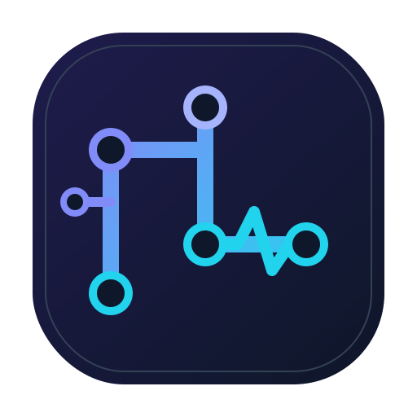

<div align="center">

[](https://github.com/s00d/GitPulse)
[](LICENSE)
[](https://github.com/s00d/GitPulse/releases)
[](https://github.com/s00d/GitPulse/releases)
[](https://github.com/s00d/GitPulse/issues)
[](https://github.com/s00d/GitPulse/stargazers)



# GitPulse

**GitHub menu bar companion — issues, PRs, feed, and notifications from your tray**


</div>

---

## What is GitPulse?

GitPulse is a cross-platform desktop app that lives in your system tray and keeps your GitHub work visible without opening the browser. It aggregates assigned issues, pull requests, stars, watched repos, inbox notifications, and a social activity feed into a fast, focused dashboard.

Built with **Rust + Tauri 2 + Vue 3**.

## Key features

- **Tray-first workflow** — open the app from the menu bar; close the window and keep working from the tray
- **Issues & pull requests** — grouped by repository with review queues (needs review, my PRs, waiting on author)
- **Custom tray icons** — badge counts on menu icons for quick scanning
- **Activity feed** — merged timeline from your work, people you follow, and followers
- **Stars** — starred repos and your repositories sorted by popularity (separate tray entries and dashboard tabs)
- **Watching & notifications** — unread GitHub inbox items with quick open links
- **Recent activity** — detects new and updated items across restarts
- **Repo visibility controls** — hide repositories from the app, tray menu, and notifications
- **Background refresh** — configurable polling with desktop notifications on changes; refresh shows last updated time
- **Multiple sign-in options** — GitHub device code, `gh` CLI import, or personal access token
- **Auto-updates** — signed releases with Tauri updater support

## Quick start

### Download

1. Go to [GitHub Releases](https://github.com/s00d/GitPulse/releases)
2. Download the installer for your platform (macOS, Windows, or Linux)
3. Launch GitPulse — it appears in the system tray
4. Sign in and use **Open GitPulse** from the tray menu

### Sign in

| Method | What you need |
|--------|----------------|
| **Device sign-in** | GitHub OAuth App Client ID (see [OAuth setup](src-tauri/config/README.md)) |
| **Import from `gh`** | [GitHub CLI](https://cli.github.com) with `gh auth login` |
| **Personal access token** | Classic or fine-grained token with `repo` scope in Settings |

## Interface overview

### System tray

Right-click the tray icon for quick access to:

- Recent changes (detected on refresh)
- Open issues and pull requests (with counts)
- Starred repos and your repositories by popularity
- Watching and notifications
- Refresh (with last updated time) and settings
- Open the full dashboard window

### Desktop dashboard

The main window provides:

- **Overview** — stat cards and recent activity
- **Feed** — news-style timeline of GitHub events
- **Issues / Pull Requests** — repo picker + item lists (PR category chips)
- **Stars** — Starred / Your repositories tabs with search
- **Watching / Notifications** — dedicated tabs with search
- **Settings** — token, refresh interval, repo filters, theme, notifications

On desktop, the header and sidebar stay fixed while the content area scrolls.

## Building from source

### Prerequisites

- [Rust](https://www.rust-lang.org/tools/install) (stable)
- [Node.js](https://nodejs.org/) 20+
- [pnpm](https://pnpm.io/) 9+
- [Tauri prerequisites](https://v2.tauri.app/start/prerequisites/)

### Development

```bash
git clone https://github.com/s00d/GitPulse.git
cd GitPulse
pnpm install
pnpm setup:oauth   # paste GitHub OAuth Client ID into src-tauri/config/oauth.json
pnpm tauri dev
```

### Production build

```bash
pnpm tauri build
```

See [docs/RELEASING.md](docs/RELEASING.md) for CI signing, notarization, and release workflow.

## Releasing (maintainers)

GitHub Actions workflow: **Build and Release Tauri App** (`workflow_dispatch`).

Required repository secrets:

| Secret | Purpose |
|--------|---------|
| `TAURI_PRIVATE_KEY` | Minisign private key for updater artifacts |
| `TAURI_SIGNING_PRIVATE_KEY_PASSWORD` | Optional key password |
| `APPLE_CERTIFICATE` | Developer ID Application `.p12` (base64) |
| `APPLE_CERTIFICATE_PASSWORD` | `.p12` password |
| `APPLE_ID` | Apple ID for notarization |
| `APPLE_PASSWORD` | App-specific password |
| `APPLE_TEAM_ID` | Apple Developer Team ID |
| `GITPULSE_GITHUB_CLIENT_ID` | OAuth Client ID bundled into releases |

Full instructions: [docs/RELEASING.md](docs/RELEASING.md).

## Support

- **Feedback**: [Discussions](https://github.com/s00d/GitPulse/discussions/1) — ideas and general feedback
- **Issues**: [github.com/s00d/GitPulse/issues](https://github.com/s00d/GitPulse/issues) — bugs and feature requests
- **Releases**: [github.com/s00d/GitPulse/releases](https://github.com/s00d/GitPulse/releases)

## Promotion / launch

Copy-ready posts for Show HN, Reddit, Dev.to, Discord, and Product Hunt: [docs/promotion/README.md](docs/promotion/README.md).

## License

MIT — see [LICENSE](LICENSE).
