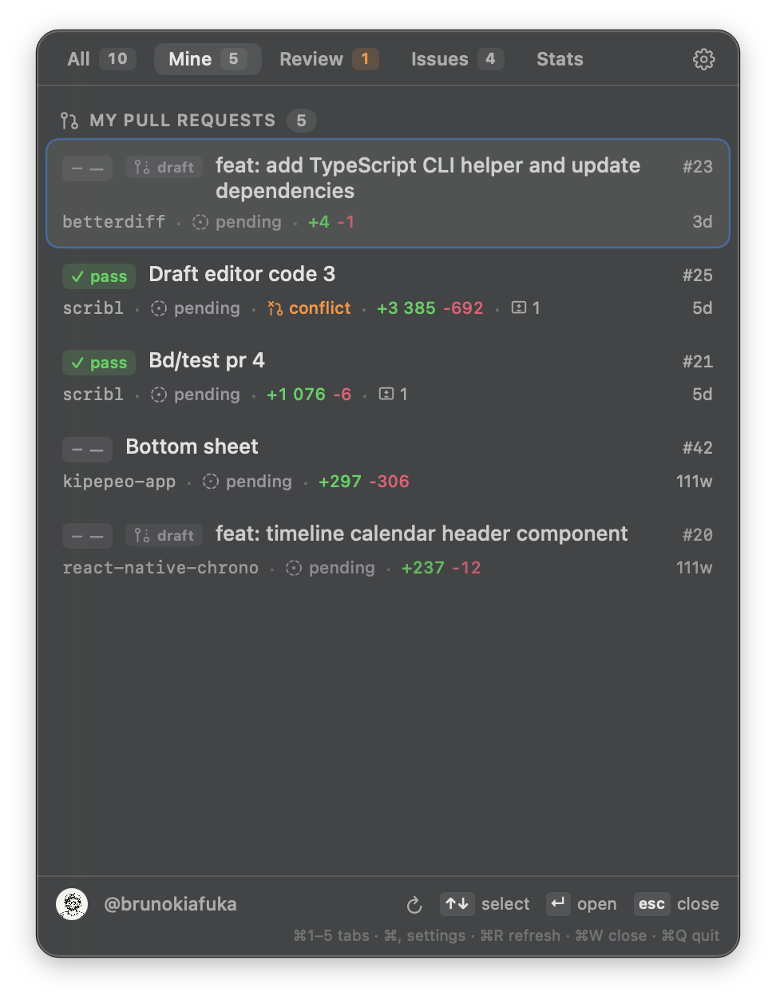
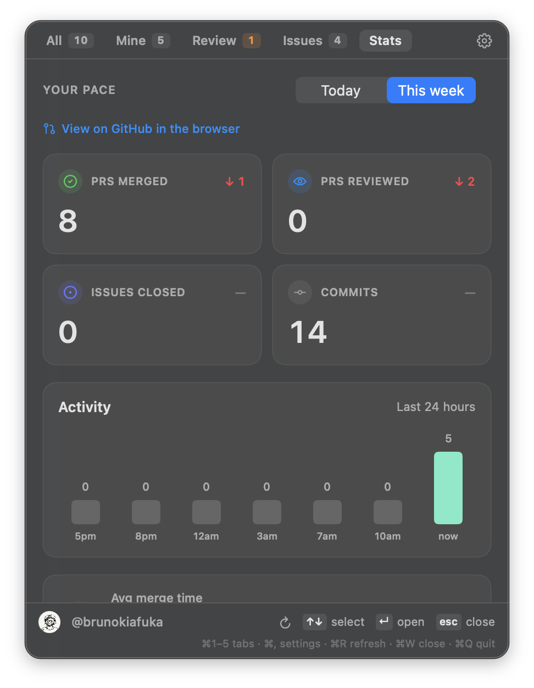

# gitbar

`gitbar` is a lightweight macOS menu bar app that helps you keep up with GitHub work without living in the browser.

Open it from the menu bar and quickly check:

- PRs you opened
- PRs waiting for your review
- issues assigned to you
- a simple stats snapshot

Click any row and it opens on GitHub right away.

## Screenshots

|                               Mine                               |                                Review                                 |                        Stats                        |
| :--------------------------------------------------------------: | :-------------------------------------------------------------------: | :-------------------------------------------------: |
|  |  |  |

## Quick start

### What you need

- macOS 14+
- a GitHub account — sign in via the GitHub CLI (`gh`) or paste a personal access token (see [Authentication](#authentication))

### Install with Homebrew Cask (recommended)

```bash
brew tap brunokiafuka/gitbar https://github.com/brunokiafuka/gitbar
brew install --cask gitbar
open -a Gitbar
```

Ships the prebuilt `Gitbar.app` straight into `/Applications`. No Xcode required.

### Install with Homebrew (build from source)

If you prefer a from-source install (or want the `gitbar` CLI shim), use the formula:

```bash
brew tap brunokiafuka/gitbar https://github.com/brunokiafuka/gitbar
brew install gitbar
gitbar
```

This builds with `swift build` and requires the Xcode toolchain.

### Install from source manually

```bash
git clone https://github.com/brunokiafuka/gitbar.git
cd gitbar
./install
open "$HOME/Applications/Gitbar.app"
```

The install script builds a release app and puts `Gitbar.app` in `~/Applications`. Requires Xcode Command Line Tools (`xcode-select --install`).

## Authentication

Gitbar supports two sign-in paths. Pick the one that fits.

### Sign in with the GitHub CLI (recommended)

If you already use the [GitHub CLI](https://cli.github.com), Gitbar will reuse the credentials it already manages.

- **Already signed in to `gh`?** Launch Gitbar with no token configured and it imports the credential automatically. A green banner confirms which account was used.
- **Have `gh` installed but not signed in?** Click **Continue with GitHub CLI** in the empty state (or **Sign in via gh** in Settings). Gitbar drives `gh auth login --web` for you, shows the one-time device code, and opens https://github.com/login/device with one click.

The token stays in `gh`'s own keychain entry; Gitbar reads it via `gh auth token` and only stores it in `~/.gitbar/config.json` for the app's own use. Required scope is `repo`, which Gitbar verifies against `GET /user` before saving.

### Paste a personal access token (better for fine-grained access)

If you don't use `gh`, create a token manually.

Classic token (fastest path):

- Open [Create new token (classic)](https://github.com/settings/tokens/new?description=Gitbar&scopes=repo)
- Generate token
- Paste it into Gitbar Settings → **Personal access token**

Fine-grained token:

- Open [Create fine-grained token](https://github.com/settings/personal-access-tokens/new?name=Gitbar&description=Gitbar%20menu%20bar%20app)
- Choose repository access
- Set these permissions:
  - Pull requests: Read and write (merge)
  - Issues: Read
  - Metadata: Read
- Paste token into Gitbar Settings → **Personal access token**

### Where the token lives

Gitbar stores the token in plaintext at `~/.gitbar/config.json` under `github.token`. Remove it from Settings → **Account** → **Remove**, or delete the file directly.

## Roadmap

Current release is an MVP. Planned improvements are tracked on the [issues tab](https://github.com/brunokiafuka/gitbar/issues).
